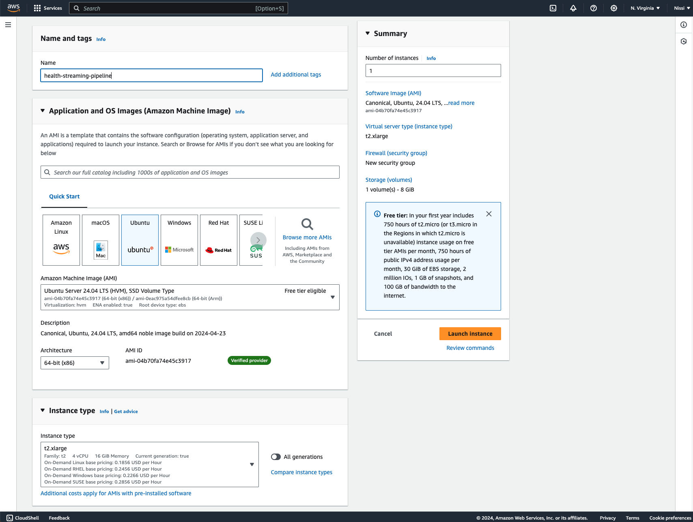

<h1><strong>Real-Time Health Data Streaming Pipeline with Kafka and Spark</strong></h1>

<h2><strong>Overview</strong></h2>
This project implements a real-time data streaming pipeline capable of handling data from a system that ingests health metrics such as heart rate and oxygen saturation level from patients' smart watch devices and triggers emergency vehicle dispatch within a certain radius if any health metrics exceed abnormal levels. The data generated mimics real-time APIs that supply this data for analytics.

<h2><strong>Getting Started</strong></h2>
To get started with this project you need:
- Intermediate Python Proficiency
- Docker Desktop 
- An AWS Account

<h2><strong>Architecture</strong></h2>
The architecture of the pipeline includes the following components:

**Data Ingestion**: Two API endpoints provide health metrics in JSON format. 
**Kafka Streams**: Used for ingesting and streaming real-time data. 
**PySpark**: Structured streaming to process and transform data. 
**Amazon S3**: Storage for processed data in Parquet format. 
**AWS Glue**: Crawlers to detect new Parquet files in S3 and update Glue tables. 
**Docker**: Containerization for easy deployment. 
**AWS EC2**: Deployment environment with a domain pointing to the instance.

<h2><strong>Workflow</strong></h2>

**1. Data Ingestion:** Health Data(such as heart rate, oxygen saturation level) and Vehicle Data (such as dispatch time, vehicle location etc) are ingested in JSON (mimicing an API endpoint)  
**2. Data Streaming:** Kafka streams consume the data.
c
 
**3. Data Processing:** PySpark processes the ingested data which is transformed and structured for further analytics. 
**4. Data Storage:** Processed data is stored in Amazon S3 as Parquet files.

 
**5. Data Cataloging:** AWS Glue crawlers detect new Parquet files and update the Glue data catalog.
Tables in Glue are updated to reflect the new data and can be queried using AWS Athena.

<h2><strong>Deployment</strong></h2>
The entire pipeline is containerized using Docker and deployed on an AWS EC2 with an elastic IP pointing to the domain 'health-streaming.com'. 
1. I set up an EC2 instance using the latest Ubuntu version t2.xlarge (or bigger). 

 
  
2. I edited the security group (associated with the EC2 instance inbound rules to allow TCP traffic (all) for ports 80(HTTP), 443(HTTPS), 22(SSH) and 9090(Kafka UI).   
3. 

