<h1><strong>Real-Time Health Data Streaming Pipeline with Kafka and Spark</strong></h1>

<h2><strong>Overview</strong></h2>
This project implements a real-time data streaming pipeline designed to analyze emergency rersponses to health metrics such as heart rate and oxygen saturation levels that exceed given threshold . The data simulates outputs from an existing system that triggers emergency vehicle dispatches within a certain radius of a patient's location. This pipeline generates data that mimics real-time APIs, providing a reliable way to discover valuable insights. <br>
In this project, I avoid delving into the details of how the system that generates this data can be designed. Instead, I focus on how the outputted real-time data can be processed and harnessed for analytics."

<h2><strong>Getting Started</strong></h2>
To get started with this project you need:
- Intermediate Python Proficiency
- Docker Desktop 
- An AWS Account

<h2><strong>Architecture</strong></h2>
The architecture of the pipeline includes the following components:

**Data Ingestion**: Two API endpoints provide health metrics in JSON format.<br>
**Kafka Streams**: Used for ingesting and streaming real-time data.<br>
**PySpark**: Structured streaming to process and transform data.<br>
**Amazon S3**: Storage for processed data in Parquet format.<br>
**AWS Glue**: Crawlers to detect new Parquet files in S3 and update Glue tables.<br>
**Docker**: Containerization for easy deployment.<br>
**AWS EC2**: Deployment environment with a domain pointing to the instance.

<h2><strong>Workflow</strong></h2>

**1. Data Ingestion:** Health Data(such as heart rate, oxygen saturation level) and Vehicle Data (such as dispatch time, vehicle location etc) are ingested in JSON (mimicing an API endpoint) <br>
**2. Data Streaming:** Kafka streams consume the data.
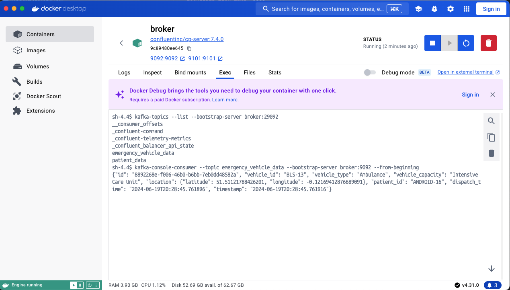
<br>
**3. Data Processing:** PySpark processes the ingested data which is transformed and structured for further analytics.<br>
**4. Data Storage:** Processed data is stored in Amazon S3 as Parquet files.
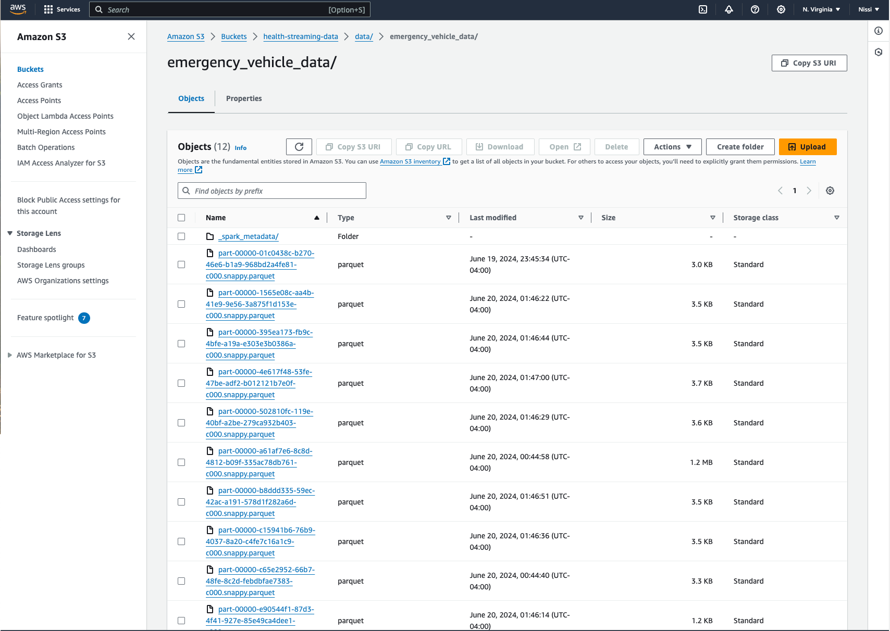
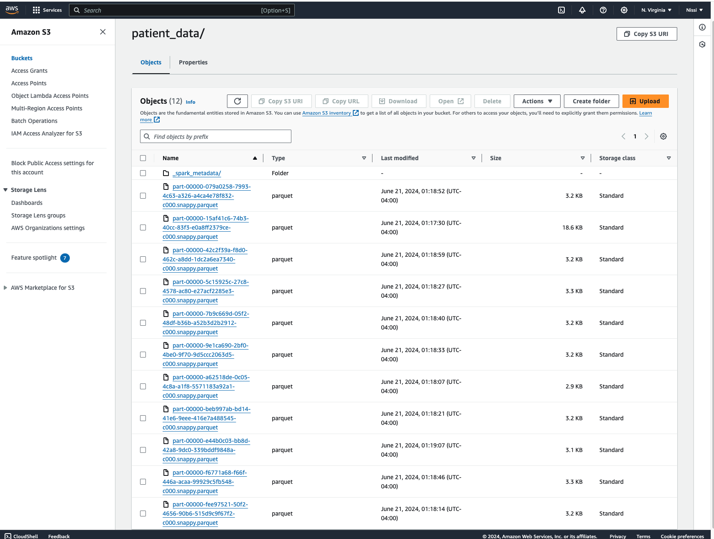
<br>
**5. Data Cataloging:** AWS Glue crawlers detect new Parquet files and update the Glue data catalog.
Tables in Glue are updated to reflect the new data and can be queried using AWS Athena.
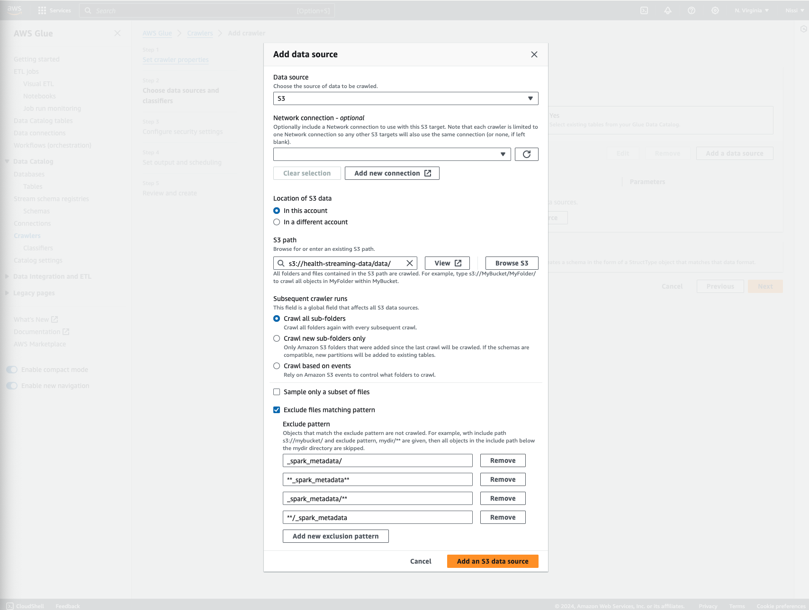
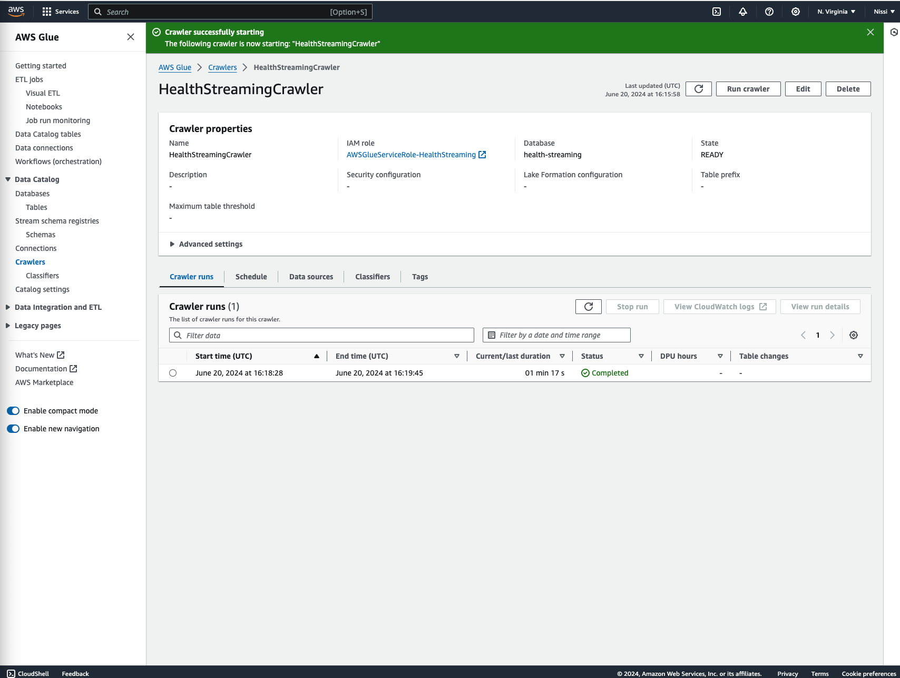
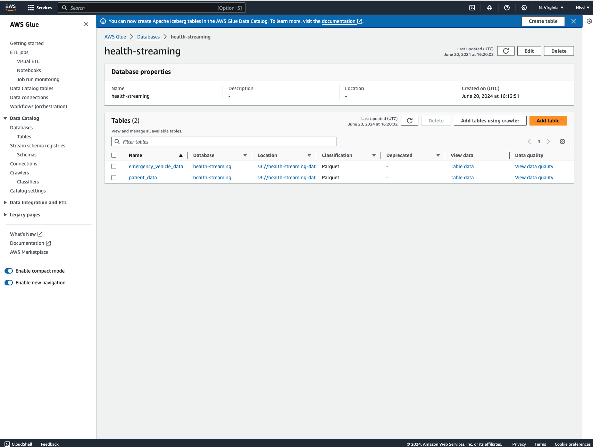

<h2><strong>Deployment</strong></h2>
The entire pipeline, from ingestion until the data is dumped in S3, is containerized using Docker and deployed on an AWS EC2.<br>
1. I set up an EC2 instance using the latest Ubuntu version t2.xlarge (or bigger). 
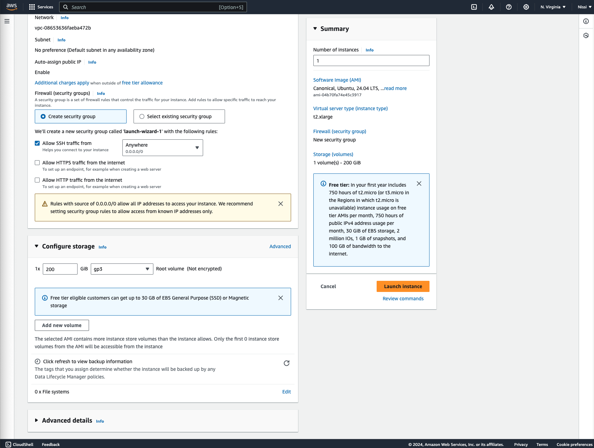<br>
2. I edited the security group (associated with the EC2 instance inbound rules to allow TCP traffic (all) for ports 80(HTTP), 443(HTTPS), 22(SSH) and 9090(Spark UI). <br>
<br>
3. I allocated an Elastic IP and associated it with the EC2 instance. This is then points to domain 'health-streaming.com'.
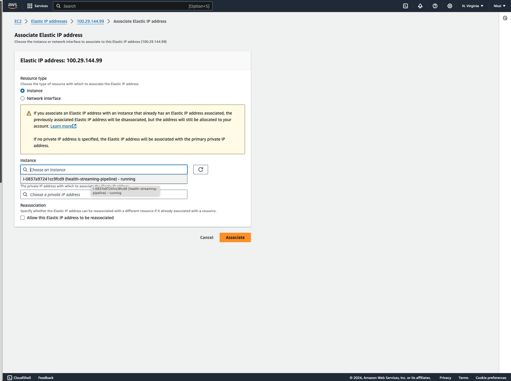
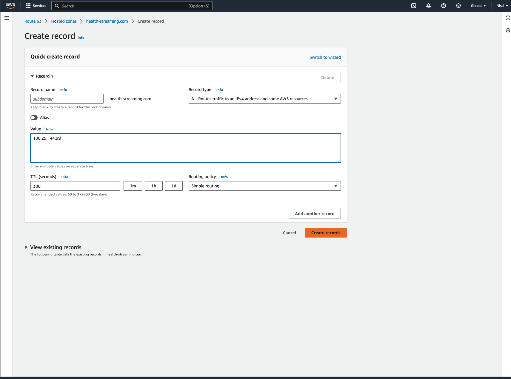<br>
4.I created a new IAM role with full S3 access and associatyed this with my EC2 instance.<br>
<br>

5: SSH into EC2 instance. Please see ([deployment-instructions](https://github.com/nissi-devo/Emergency-Health-Streaming/blob/main/deployment-instructions.txt)) for commands. 

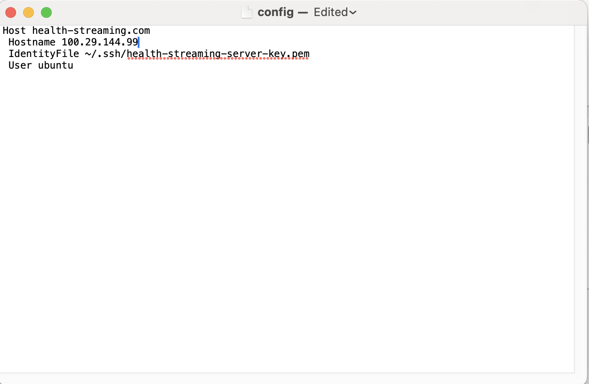 <br>
6. I installed tools and dependencies (including docker, docker-compose, venv, pip) on EC2 machine.<br>
<br>
7. I cloned the repository **prod** branch.<br>
<br>
8. I activated the virtual environment and spined up all containers.<br>
<br>
9. I executed the Kafka producer and Spark consumer jobs as background processes.<br>
<i>Note: the config file shown above must be within the .ssh folder on your local machine</i> <br>
```bash
ssh [domain-name] #Ssh into EC2 instance
docker-compose up -d #Start all containers
source venv/bin/activate #Activate virtual environment
sudo nohup venv/bin/python3 jobs/main.py &  #Run Python script that produces data to kafka as a background process
sudo nohup bash jobs/submit_spark_job.sh & ##Run Bash script that consumes data to kafka as a background process
```
<br>
10. Stop these scripts at will.

```bash
kill <PID>
```
<br>
Spark Homepage UI showing all containes are up and the spark consumer is accessible via the domain on port 9090.

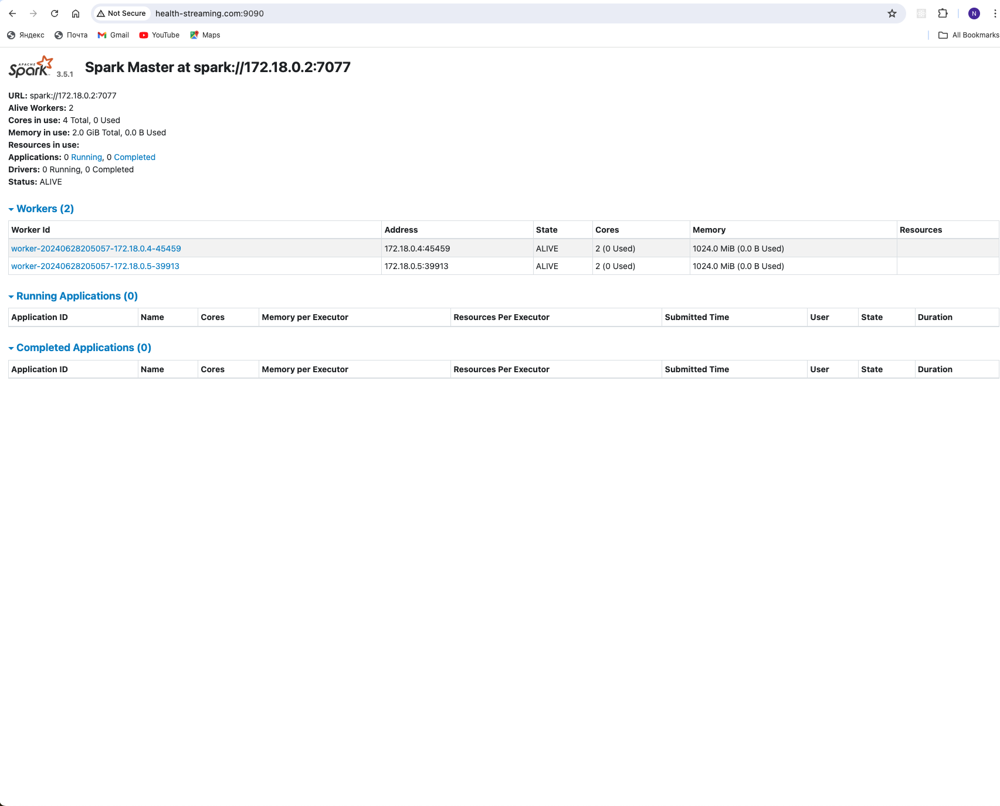 <br>

You can query these structured tables in Athena.

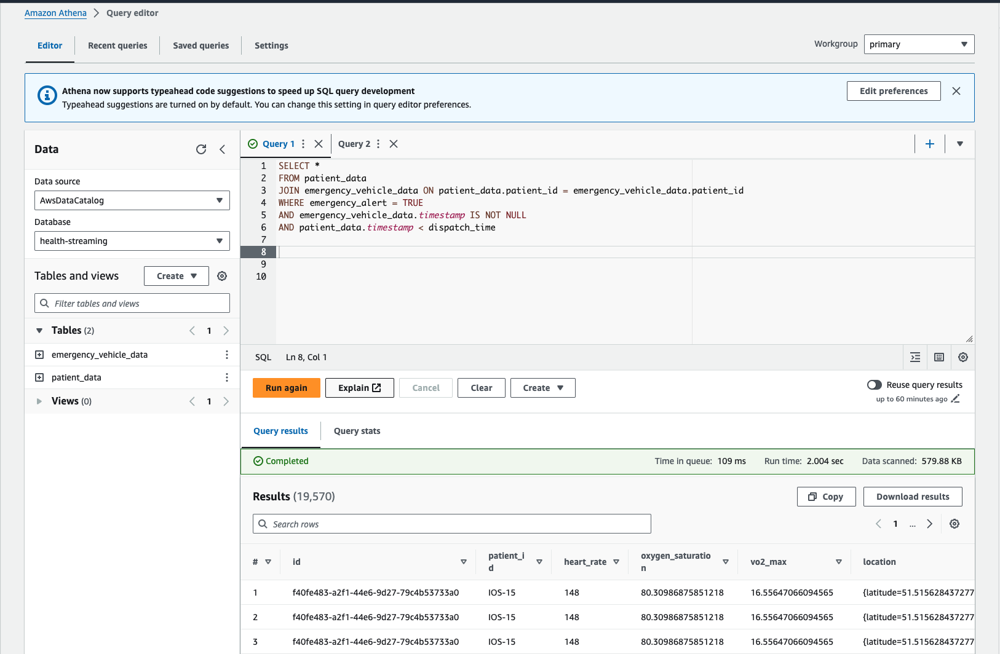 

<h2><strong>Further Work</strong></h2>
This project can be extended in various interesting ways. 
- Data from additional sources (possibly structured data regarding demographics of patients, stored in a relational database) can be merged into the pipeline. A datawarehouse, designed to fit various business use cases, can be designed and the data can be further transformed and loaded into it using a batch pipeline.
- The data can be leveraged for various use cases pertaining to predictive analytics. 

